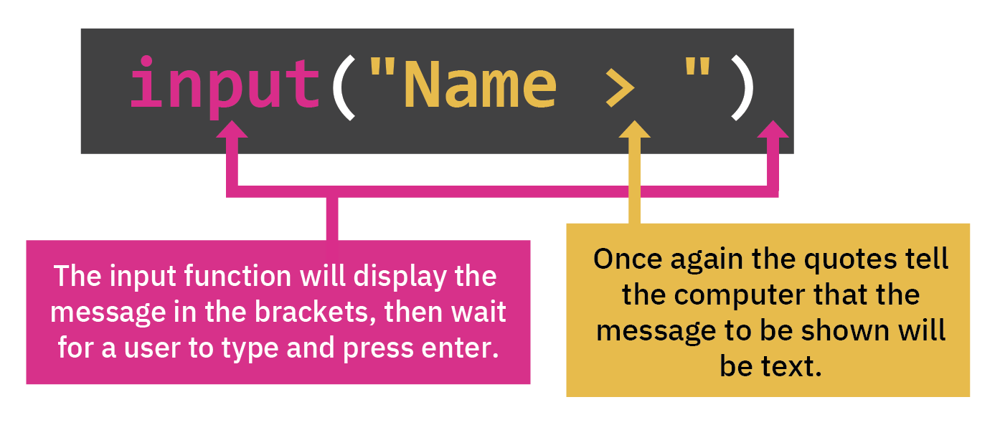
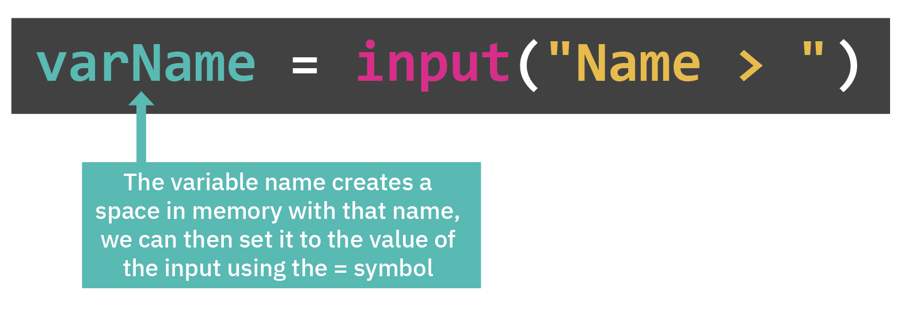
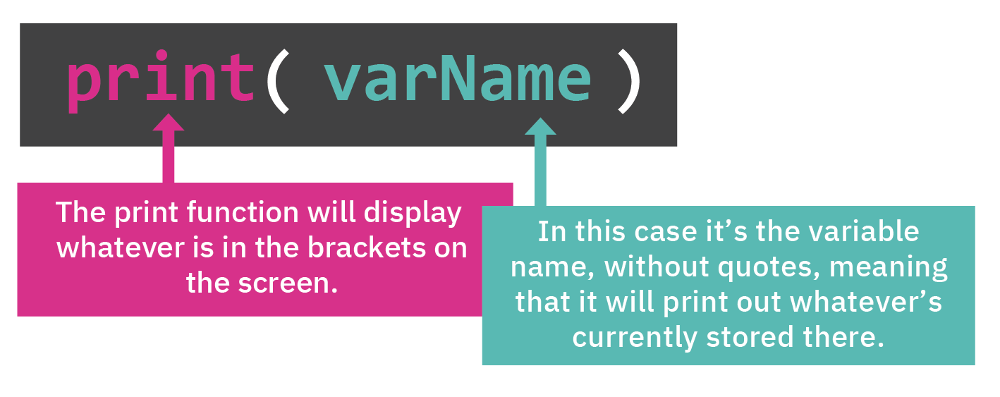

# DAY 002

## Taking user input

### Input

Let's take a look at the input command and how that works. Input is when the user gives information to the computer.



It's very similar to the `print` command, except that it'll show the message in the console then wait until the user has typed something into the console and pressed enter. Let's try it!

👉 Copy this code into your coding editor in `main.py` and see what happens when you hit `run`:

```python
input("What's your name?: ")
```

## Variables

### What is a variable?
`input` asks for something, takes it, but then has nowhere to put it. We can change that with a `variable` which is a value that we can use to name and store data. (Remember, David's box for David's phone?)



### Naming variables

- You can give a variable any name you want, but you can't use spaces. You can use:
  - underscores_between_words
  - camelCaseToMakeItEasierToRead

👉 Delete all your code and copy this into your code editor in the `main.py` file:

```python
myName = input("What's you name? ")
myAge = input("How old are you? ")
print("Gee, that's REALLY OLD")
replit = input("Do you like Replit? ")
print("OF COURSE YOU DO!")
```

- We now have three variables:
  - myName has the user's name in it
  - myAge is storing their age
  - replit is storing their feelings about this amazing website.


## Printing a Variable

You can print your variable using `print` and the name you used for your variable in your `input` command. Remember the three variables we just created: `myName`, `myAge` and `replit`?

In your code you can now print 'name' `by using print(myName)` or 'age' by using `print(myAge)`.



👉 Let's try it! Try adding this code to the end of what you've got and hit `run`:

```python
print()
print("So, you are")
print(myName)
print("and are the ripe old age of")
print(myAge)
print("and clearly think that Replit is")
print(replit)
```

Did you notice what `print()` did?

- if there is text inside `()` the text is printed
- if there is nothing inside the `()` then a blank line is added for a bit of space


## Common Errors

First, delete any other code in your `main.py` file. Copy each code snippet below into `main.py` by clicking the copy icon in the top right of each code box. Then, hit `run` and see what errors occur. Fix the errors and press `run` again until you are error free.

### Syntax Error

👉 What is wrong with the code below? Copy the code only (not the error message) and hit `run`.

```python
my variable = input("WHO GOES THERE? ")
print(my variable)
```

Did you get this error message? What can you fix?

```
  File "main.py", line 1
    my variable = input("WHO GOES THERE? ")
       ^
SyntaxError: invalid syntax
```
Did you notice the space in the variable name? We never put spaces in variable names - it just confuses the poor computer!

### Name Error

👉 What is wrong with this code? Copy only the code and press `run`.

```python
myGrandma = input("How's your Grandma doing? 😘 ")
print(mygrandma)
```

Did you get this error message? How can you fix it?

```
How's your Grandma doing? 😘 fine
Traceback (most recent call last):
  File "main.py", line 2, in <module>
    print(mygrandma)
NameError: name 'mygrandma' is not defined
```
- What we're trying to print out is NOT the same as what we set the varaible up as in the first place. The capitalization is different. `myGrandma` versus `mygrandma`

- This is also important when you try to print out a variable that you haven't created yet. You must ALWAYS create the variable BEFORE you print it out.

### This is just plain weird...

You won't get an error from this one, but the output won't make a lot of sense...

👉 Copy this code and `run` it to see what happens.

```python
myLunch = input("What are you having for lunch? ")
print("Hmm, it sounds like you really should just order")
print("myLunch")
print("as soon as possible!")
```

```
What are you having for lunch? Burrito
Hmm, it sounds like you really should just order
myLunch
as soon as possible!
```

- You've tried to print a variable, but added in quotes!
- Remember: quotes will literally print out whatever you stick in them.
- In this case it's printing the variable name instead of the contents of the variable.
- If you want the contents, then you DO NOT USE QUOTES.


## 👉 Day 2 Challenge

### Getting to Know You Project

Write code that does the following:

1. Asks for the user's name, favorite food, favorite music and where they live (or you can create other questions!)
2. Store all of the answers in different variables.
3. Print out a full sentence that includes the user's favorite things.
4. Give them a positive affirmation at the end - tell them they rock at doing something!

### Example Output

```
Getting to know you!

You are
Mark
You're probably hungry for
Burritos
and you're definitely getting your groove on to
Synthwave and Anything by our man Rick Astley
living in the amazing
Edge of reality
```