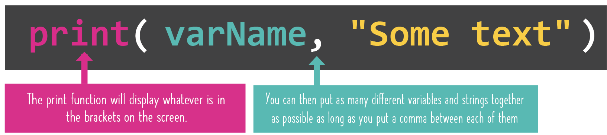

# DAY 003

## Concatenate

### Yeah, big word.

All it really means is combine text (remember, text is called a string) and variables together into single sentences! 😲🤯

You can make your input and output look super pretty now! 🥳

👉 Copy the code below into `main.py` and `run` it. See what it does:

```python
myName = input("What's your name? ")
myLunch = input("What are you having for lunch? ")
print(myName, "is going to be chowing down on", myLunch, "very soon!")
```

You just made a full sentence, right? But how did it work?

- It turns out `print` has a super-power. We can give it as many different things to print as we want. All we need to do is put a comma `,` between every different thing in the `()`.



👉 Let's go BIG and try a bunch of code... You probably know this by now, but make sure you delete any old code first and add all code to `main.py`.

```python
number = input("Give me a number: ")
group = input("Give me a collective noun for a group of things: ")
thing = input("Give me the name of a weird or wacky thing: ")
print("No I don't think that", number, "is a", group, "of", thing,". That's just odd.")
```

You can combine as many things as you want in any order you want, as long as they're separated by that comma!


## Common Errors

First, delete any other code in your `main.py` file. Copy each code snippet below into `main.py` by clicking the copy icon in the top right of each code box. Then, hit `run` and see what errors occur. Fix the errors and press `run` again until you are error free. Click on the '👀 Answer' to compare your code to the correct code.

### Invalid Syntax

👉 Copy the code below, hit `run` and see what happens.

```python
yourName = input("Name: ")
whatYear = input("What year is it?: ")
print(yourName "thinks it is" whatYear)
```

What does this error mean? How can you fix it?

```
  File "main.py", line 3
    print(yourname "thinks it is" whatYear)
                   ^
SyntaxError: invalid syntax
```

- An easy mistake to make is to forget one or more commas.
- Remember that you need a `,` between each different object you're trying to print out.
- Without `,` the computer gets confused and shows an error.

### Your code may run...but look weird

👉 This code would actually run, but...

```python
yourName = input("Name: ")
whatYear = input("What year is it?: ")
print("yourName, thinks it is, whatYear")
```

give this output. What's weird about this code?

```
Name: Mark
What year is it?: 2431
yourname, thinks it is, whatYear
```

- Another common error occurs when you wrap the entire thing in quotes `(".., .., .. ")`.
- This actually runs, but doesn't quite do what you want.
- Everything in `(".., .., .. ")` gets printed literally.
- Since the variable names are alo within quotes `(".., .., .. ")`, it's literally printing the names rather than the contents.
  - The only thing in quotes should be the *literal* strings `print(varName, "literal string", varName2)`.


## 👉 Day 3 Challenge

### The Ultimate Wacky Recipe Maker

We have learned enough skills for a simple, but cool, project!

Remember when you were a kid and thought the ideal dinner would just be all your favorite things mixed in a bowl? How did that Nutella Mac & Cheese taste? **Well - let's come up with a recipe generator to build us an amazing dish for today's evening meal!**

You will need to:

1. Create these as a variable:
   - A type of food
   - A type of plant
   - A method of cooking
   - A word to describe burned food
   - A household item

2. Output a nice looking Recipe page that *concatenates* a dish in this format:
   - `cooking` `food` with `burned` `plant` on a bed of `item`


Example Output:
```
Name a food > Mac & Cheese
Name a type of plant > Cactus
Name a method of cooking > Saute

What word describes burned food? > Ruined
Name a DIY item > Hammer

MENU
Saute Mac & Cheese with Ruined Cactus on a bed of Hammers
```

*EXTRA: Remix your recipe to include more variables and a wackier type of dish.*

Why not step it up and create a recipe for a starter, main course and dessert?