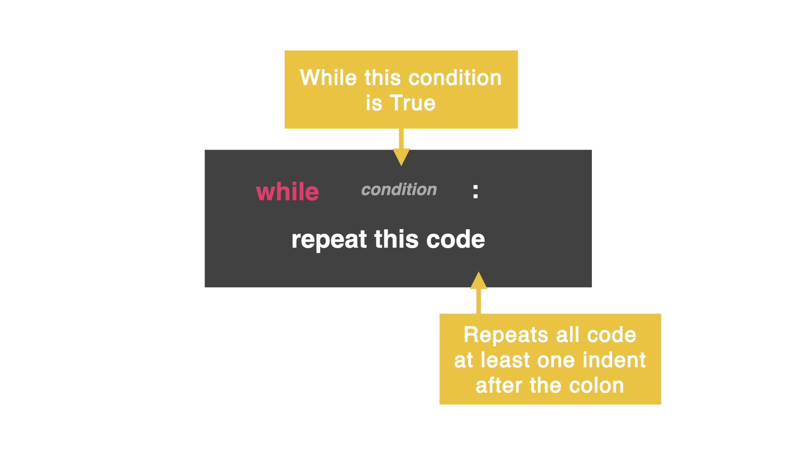

## All About Loops

On Day 14, you created an epic rock, paper, scissors game, but we had to click `run` every time (which makes for a terrible experience!) Let's fix that with a `while` loop...

### While Loop

A `while` loop allows your code to repeat itself based on a condition you set.

It is similar to an `if` statement in that you ask a question, and as long as the answer is true, the computer will repeatedly run the code.



In the code below, the variable is called `counter` and starts at zero. The `while` loop has the condition saying, "while the counter is less than ten do this..."

In this case, `print` the variable and then add `+=1` to that variable. As long as variable is less than 10, the loop will repeat the code.

```python
counter = 0
while counter < 10:
  print(counter)
  counter +=1
```


## Infinite Loop

You have to be really careful that you don't accidentally invoke an infinite loop! This is where the computer will loop code until the end of time. Without a break. Forever. 😭

### Fix an infinite loop by adding:

```python
  variable +=1
```

This is just saying "count to 10 by 1 each time." to make the loop end.

Don't forget, if your condition is a `>` then you might need to `-=`. This will subtract from the variable instead of adding to it.


## Common Errors

First, delete any other code in your `main.py` file. Copy each code snippet below into `main.py` by clicking the copy icon in the top right of each code box. Then, hit `run` and see what errors occur. Fix the errors and press `run` again until you are error free. 

### Infinite Loop
`Run` this code. What happens?

```python
counter = 0
while counter < 10:
  print(counter)
```

You see a series of infinite 0s printing over and over. Why? You have created an infinite loop because the counter will always be less than 10 in this case. Manually stop the program and specify `counter +=1`.

### Nothing happens...

`Run` this code. What goes wrong?

```python
counter = 0
while counter > 6:
  print(counter)
  counter += 1
```

The issue is the condition. It is the wrong way around. The inequality is saying when the counter is greater than 6 to add one. However, the counter is 0. Therefore, it is not greater than six to start.

Fix this by sorting out the inequality to `<`.

### Exit

You can use a `while` loop with text too. In the code below, the while condition is saying "as long as you do not type yes, the computer will type 🥳."

`Run` this code. What do you see?

```python
exit = ""
while exit != "yes":
  print("🥳")
exit = input("Exit?: ")
```

Wait! No matter what you type, you get 🥳. Check your indentation. Change the variable that controls the condition *within* the loop itself.

```python
exit = ""
while exit != "yes":
  print("🥳")
  exit = input("Exit?: ")
```


## 👉 Day 15 Challenge

Write a program that loops. Inside the loop, ask the user what animal sound they want to hear.

### Example

```
What animal do you want?: Cow
A cow goes moo.

Do you want to exit?: no

What animal do you want?: A Lesser Spotted lemur
Ummm...the Lesser Spotter Lemur goes awooga.

Do you want to exit?: yes
```