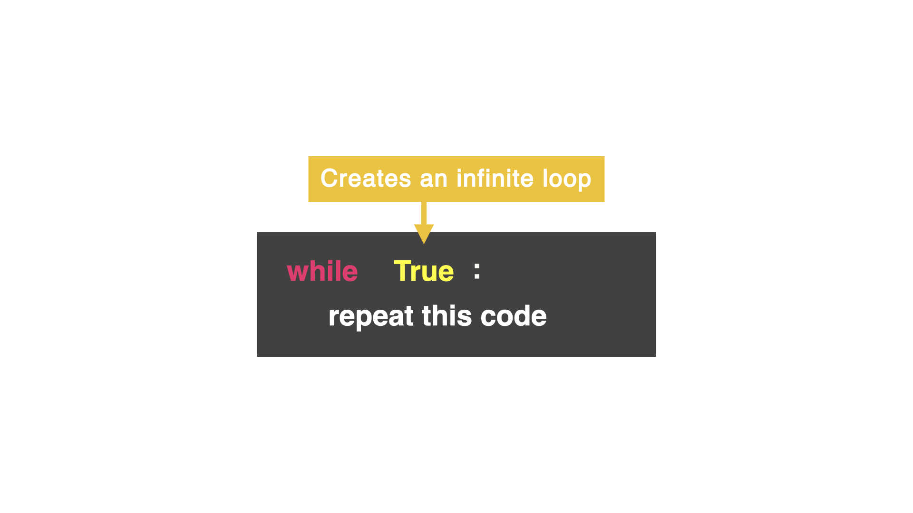
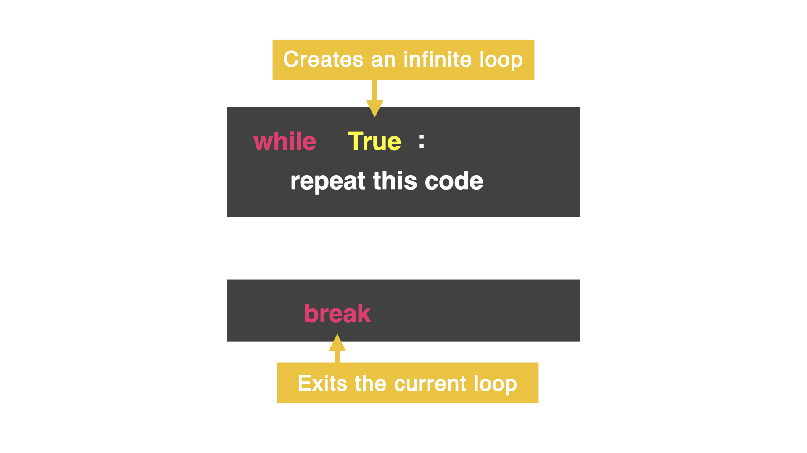

## while True Loop

On Day 15, you learned how to create a `while` loop. However, there are a lot of moving parts that can turn the `while` loop into an accidental infinite loop...and a nightmare.

### Introducing the while True loop...



### 👉Let's try it out.

What do you think the below code does?

Remember you can use the Stop button if your program does not end.

```python
while True:
  print("This program is running")
print("Aww, I was having a good time 😭")
```

This type of loop only has two conditions: `True` and `False`. Make note of the capital *"T"* and *"F"*.

In this loop, I am saying to the computer:

"while True is True...do this over and over again."


## Make it stop

There is a way to stop the loop with the word `break`. This exits the loop and stops all code at that point. Even if there is more code written after `break` that is *inside* the loop.

After `break`, the computer jumps out of the loop to the next unindented line of code.



### 👉 Let's try it out

`Run` the code below and notice how the loop will continue until `break`. Then the next line of unindented code will run.

```python
while True:
  print("This program is running")
  goAgain = input("Go again?: ")
  if goAgain == "no":
    break
print("Aww, I was having a good time 😭")
```


## Common Errors
First, delete any other code in your `main.py` file. Copy each code snippet below into `main.py` by clicking the copy icon in the top right of each code box. Then, hit `run` and see what errors occur. Fix the errors and press `run` again until you are error free.

### Name Error

👉 What is the error here?

```python
counter = 0
while true:
  answer = int(input("Enter a number: "))
  print("Adding it up!")
  counter += answer
  print("Current total is", counter)
  addAnother = input("Add another? ")
  if addAnother == "no":
    break
print("Bye!")
```

`while true` needs to be `while True`.

Notice when you change the lowercase "t" to a capital "T", the color of the word changes as Replit is now recognizing this as a Boolean loop.

### Syntax Error

👉 What about this one? What happens when you hit `run`?

```python
counter = 0
while True:
  answer = int(input("Enter a number: "))
  print("Adding it up!")
  counter += answer
  print("Current total is", counter)
addAnother = input("Add another? ")
if addAnother == "no":
  break
print("Bye!")
```

Notice the error message is saying the syntax error "break outside loop". Do you notice how the last three lines before the bottom `print` statement are not a part of the loop as they are not properly indented (look at the vertical lines)?

Highlight these three lines of code and press `tab` key one time to indent this code so it is inside the loop.


## 👉 Day 16 Challenge

Create a "Name the Lyrics" game. Write your favorite song lyrics with a word or two missing. The user has to figure out the correct song lyric in as few attempts as possible. Find the true lyric master among you!

### Example

```
Fill in the blank lyrics!
(Type in the blank lyrics and see if you are as cool as me.)
Never going to ______ you up.
put
Nope, try again.
Never going to ______ you up.
let
Nope, try again.
Never going to ______ you up.
give
Well done! It only took you 3 attempts.
```