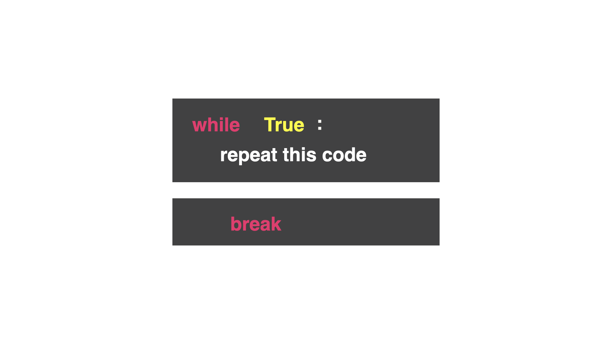
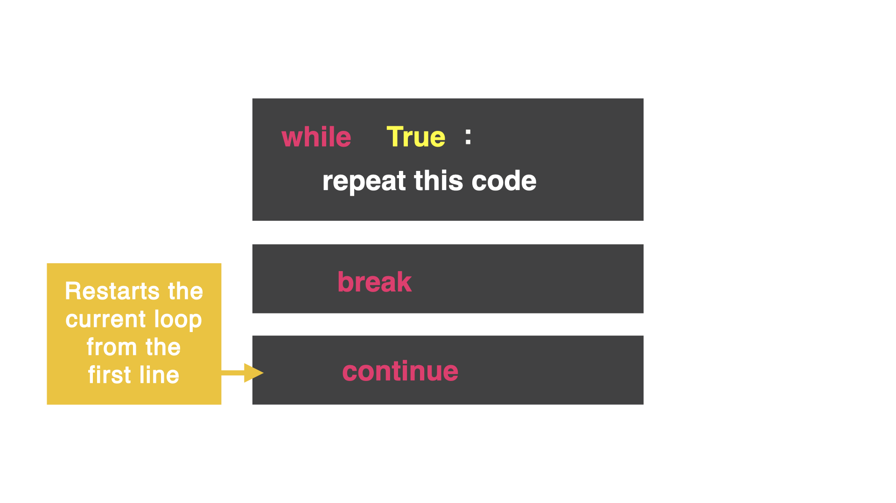
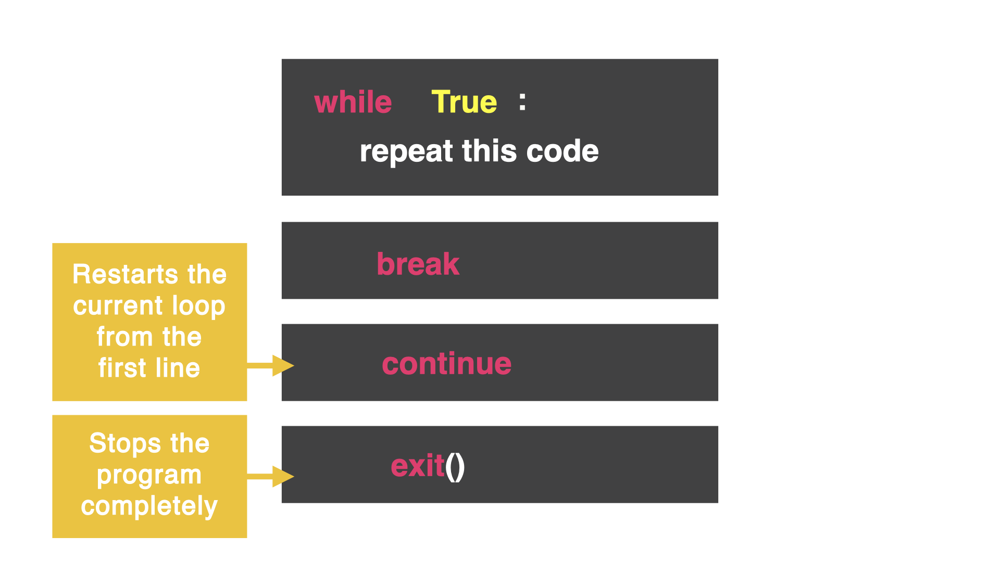

## Another Cheat

So far we've used `break` in the `while True` loop. `break` leaves the loop completely and runs the next unindented line of code. However, you may want to stop the code and start the loop from the top again. (This is ideal for building games!)



In the code below, the game runs and the user is asked if they want to go left or right. If the user chooses left, they fall to their death, and `break` will kick the user out of the loop. That's the game.

```python
while True:
  print("You are in a corridor, do you go left or right?")
  direction = input("> ")
  if direction == "left":
    print("You have fallen to your death")
    break
```

## The Continue Command

The `continue` command stops executing code in the loop and starts at the top of the loop again. Essentially, we want to kick the user back to the original question.



Adding `continue` will start the code from the start and ask the first question again: "Do you go left or right?".

```python
while True:
  print("You are in a corridor, do you go left or right?")
  direction = input("> ")
  if direction == "left":
    print("You have fallen to your death")
    break
  elif direction == "right":
    continue
  else:
    print("Ahh! You're a genius, you've won")
```

The `else` statement refers to any input besides left or right (up or esc). Since the user is a winner, we do not want to use `break` or it would say they have failed.


## Proceed to the Nearest Exit

The previous code continues to loop even after the user has won. Let's fix that with the `exit()` command



The `exit()` command completely stops the program and it will not run any more lines of code.

```python
while True:
  print("You are in a corridor, do you go left or right?")
  direction = input("> ")
  if direction == "left":
    print("You have fallen to your death")
    break
  elif direction == "right":
    continue
  else:
    print("Ahh! You're a genius, you've won")
    exit()
print("The game is over, you've failed!")
```


## Common Errors
First, delete any other code in your `main.py` file. Copy each code snippet below into `main.py` by clicking the copy icon in the top right of each code box. Then, hit `run` and see what errors occur. Fix the errors and press `run` again until you are error free.

### 👉 What is wrong here?
```python
while True:
  print("You are in a corridor, do you go left or right?")
  direction = input("> ")
  if direction == "left":
    print("You have fallen to your death")
    break
  elif direction == "right":
    continue
  else:
    print("Ahh! You're a genius, you've won")
    exit
print("The game is over, you've failed!")
```

`exit` is a function and needs `()`. The moment you add the `()` you notice the color change of `exit` from white to yellow.

```python
while True:
  print("You are in a coridoor, do you go left or right?")
  direction = input("> ")
  if direction == "left":
    print("You have fallen to your death")
    break
  elif direction == "right":
    continue
  else:
    print("Ahh! You're a genius, you've won")
    exit ()
print("The game is over, you've failed!")
```


## 👉 Day 17 Challenge
Go find your Rock, Paper, Scissors game from Day 14 and add the code here before you start. We are going to build upon this game.

1. Use a loop to repeat the game multiple rounds.
2. Keep score of player 1 and player 2.
3. End the game when a player wins three rounds using `break` and `exit`.
4. Use `continue` to restart the round until one player wins three rounds.
5. Your last bit of code should be the results of which player won.